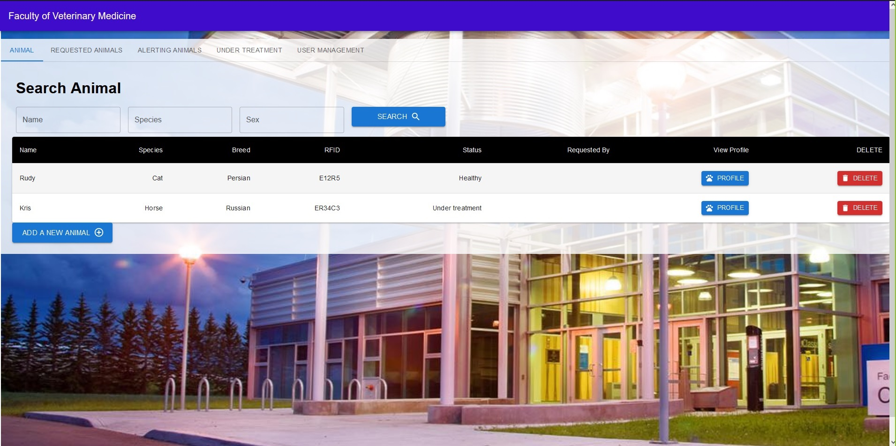
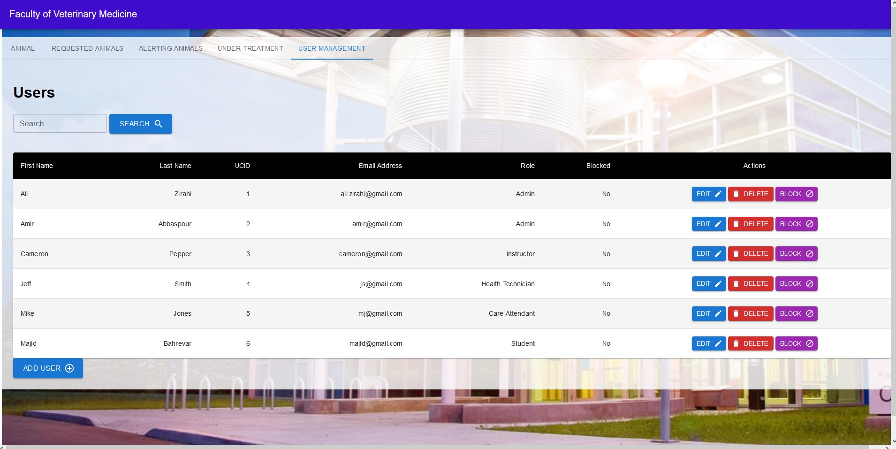

# Final-Project
607 final project

Amir Abbaspour 	30076398  
Cameron Pepper 	30142126  
ALi Zirahi	30036449  

**Please follow these steps to test our app**
- First, run the Vet_Application_Database.sql databse file
> - Make sure you update your credentials in the application.properites for the database connection (\JavaProject\src\main\resources\application.properties)
> > - User name
> > - Password

- Run the java code from Application.java
- Run the front-end react code
- The SQL file (Vet_Application_Database.sql) contains the userid and pass of the already filled users
 > - For example ucid:2 and password "222" as an Admin

- You can also use swagger to test the APIs ("http://localhost:8090/swagger-ui/")

**Please note**: The "sex" attribute of animal class is set to Character ('m' or 'f')!

- **For more details please refer to our video demo. You can find it in this repo (ENSF607_FinalProjectDemo.mp4).**

# Some screenshots

